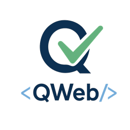

> Keyword based test automation for the web.

---
![License][license-badge]
![Python versions][python-versions-badge]
![Release][pypi-badge]
![Windows Acceptance][win_ci_badge]
![Linux Acceptance][linux_ci_badge]
![MacOS Acceptance][macos_ci_badge]
[![Tested with][pace-badge]][pace-url]
[![Slack][slack-badge]][slack-url]

### Table of Contents

- [Introduction](#introduction)
  - [Quick Example](#quick-example)
- [Requirements](#requirements)
- [Installation](#installation)
  - [Windows](#windows)
  - [Linux/Mac](#linuxmac)
  - [Automatic browser \& driver management](#automatic-browser--driver-management)
  - [Manual driver management](#manual-driver-management)
- [Usage](#usage)
  - [Keyword documentation](#keyword-documentation)
  - [Examples](#examples)
    - [Basic usage](#basic-usage)
    - [Shadow DOMs and visibility](#shadow-doms-and-visibility)
    - [Timeouts and anchors](#timeouts-and-anchors)
    - [Other locators](#other-locators)
    - [Working with tables](#working-with-tables)
    - [Changing configuration](#changing-configuration)
    - [Running with Python](#running-with-python)
- [Changelog](#changelog)
- [Contribute](#contribute)
- [Community](#community)
- [License](#license)
- [Resources](#resources)

---

## Introduction

QWeb is a powerful and versatile [Robot Framework](https://robotframework.org/) library designed for efficient, reliable, and maintainable web testing and automation. Its core strength lies in an intuitive, human-readable syntax that allows teams to write and maintain even complex test cases with minimal effort. 

QWeb's philosophy is to give you the best of both worlds: text-based automation for 80–90 % of cases where brittle XPath/CSS selectors aren’t needed, and precise DOM targeting for the tricky 10–20 % where they are.

QWeb aims to make web automation easy and maintainable by:
* **Intuitive, human-readable syntax** for writing and maintaining complex test cases.
* **Smart locators**: find elements by visible text or any attribute value with simple, natural syntax.
* **Automatic waits**: built-in retry logic in most keywords eliminates the need for explicit wait calls.
* **Automatic frame handling**: automatically searches across all iframes without manual frame-switching.
* **Automatic alert handling**: gracefully manages unexpected browser alerts.
* **Shadow dom support**: easily locate and interact with elements in shadow roots.
* **In-built bitmap comparison**: handle edge cases where no attribute or text can reliably identify an element.
* **Technology agnostic**: works across a wide range of web technologies and frameworks. 

### Quick Example

```RobotFramework
*** Settings ***
Library    QWeb

*** Test Cases ***
User Can Log In
    Open Browser    https://example.com      chrome
    Type Text       Email       demo@example.com
    Type Text       Password    changeme
    Click Text      Sign in
    Verify Text     Dashboard

```

See more [examples](#examples).

[Back To The Top](#qweb)

---
## Requirements
Python **3.10-3.13** and Robot Framework 5.0.1 or above.

(Note that support on Macs with Apple based silicon (M1) requires MacOS version 12/Monterey or above or [custom installation](https://github.com/qentinelqi/qweb/blob/master/docs/qweb_mac_m1_installation.md).)

## Installation

### Windows
```bash
    pip install QWeb
```

### Linux/Mac

Some Linux distributions (Ubuntu) use snap to install browsers, which brings it's own problems with non-default binary, 
user data-dir and/or profile location. We suggest installing the browser via terminal, for example:

```bash
    wget https://dl.google.com/linux/direct/google-chrome-stable_current_amd64.deb
    apt-get install -y ./google-chrome-stable_current_amd64.deb
```

Make sure the following dependencies are installed:

```bash
    sudo apt-get install python3-tk python3-dev scrot
    pip install python-xlib
```

```bash
    python3 -m pip install -U pip
    python3 -m pip install QWeb
```

Running the above command installs also supported Selenium and Robot Framework versions + other dependencies.

### Automatic browser & driver management
Since Selenium 4.10.0 `browser drivers` can be automatically downloaded and installed using Selenium Manager, provided that driver is not found in PATH.

For Chrome `browser_version` can also be given; if your locally installed Chrome matches this version,
it will be used. If not, a suitable version of `Chrome for Testing` will be automatically downloaded.

Examples in [OpenBrowser keyword documentation](https://qentinelqi.github.io/qweb/QWeb.html#Open%20Browser)


### Manual driver management
For manual installation of drivers, please refer to [Selenium documentation](https://www.selenium.dev/selenium/docs/api/py/index.html#drivers) for more information OR use 3rd party packages like [WebDriverManager](https://pypi.org/project/webdrivermanager/).

NOTE: Manual driver management should only be used in exceptional cases. Letting Selenium Manager handle
drivers is the preferred, less error prone option.


[Back To The Top](#qweb)

---


## Usage

### Keyword documentation
See list of keywords and their usage on 

* [Keyword documentation](https://qentinelqi.github.io/qweb/QWeb.html)
* [Copado Robotic Testing support pages](https://docs.copado.com/articles/#!copado-robotic-testing-publication/all-qwords) 

[Back To The Top](#qweb)

### Examples

#### Basic usage

The preferred way to interact with web elements is using their **text** property. Most elements like input fields and dropdowns can also be found by closest label (text).

```RobotFramework
*** Settings ***
Library    QWeb     # Import library

*** Test Cases ***
Basic interaction
    OpenBrowser         https://qentinelqi.github.io/shop      chrome   # Open chrome and goto given url
    VerifyText          The animal friendly clothing company            # Assert heading text
    ClickText           Scar the Lion                                   # Click link text
    ClickText           Add to cart                                     # Click *button* with specific text
    DropDown            Size            Large                           # Select value (Large) from dropdown (Size)

```
#### Shadow DOMs and visibility
Most common cases when text or element is not found are:
- Element has (incorrectly?) some attribute set so, that it's considered invisible.
- Element is under shadow dom (i.e. has #shadow-root parent element)

QWeb searches for visible elements by default, but can be instructed to work with invisible elements as well. See keyword documentation of **SetConfig** and the following parameters:
- Visibility
- Offsetcheck
- InViewport

Elements under shadow DOM can not be found using xpaths. However, all *Text, *Item and *Input keywords do support extending the search to Shadow DOM elements. We intentionally keep this under separate setting for ensuring compatibility with older test cases. 

Example:
```RobotFramework
*** Settings ***
Library    QWeb     # Import library

*** Test Cases ***
Click shadow dom element
  SetConfig            ShadowDOM            True  # extends search to shadow dom elements
  OpenBrowser          chrome://settings/content/popups   chrome
  ClickText            Sites can send pop-ups 
```

#### Timeouts and anchors

By default QWeb tries to locate the element 10 seconds (default time can be configured). Timeout can also be individually given for each keyword as an argument.

When text to be found is not unique, an 'anchor' argument can be given to pinpoint which instance of text we want to interact with. Anchor can be either another text nearby or index.

```RobotFramework
ClickText   Sign-in
ClickText   Sign-in     timeout=30

ClickText   Sign-in     anchor=Email
ClickText   Sign-in     index=3
```

#### Other locators

Non-textual locators can be used with `ClickElement`and `ClickItem`keywords.

```RobotFramework
ClickElement    xpath\=//button[@class="my_class"]   # xpath
ClickItem       Increment quantity                   # alt text

```

#### Working with tables

QWeb includes keywords to interact with table data easily.

Consider the following table as an example:


```RobotFramework
UseTable    Firstname

${row}=     GetTableRow     //last                        # returns 5
${row}=     GetTableRow     //last    skip_header=True    # returns 4
...
${row}=     GetTableRow     Jim                           # returns 4
${row}=     GetTableRow     Jim    skip_header=True       # returns 3

${cell_value}=     GetCellText     r1c2                   # Returns "John", first name is column 2.

${cell_value}=     GetCellText     r-1/c2                 # Returns "Tina", -1 points to last row
${cell_value}=     GetCellText     r-2/c2                 # Returns "Jim", -2 points to second last row
```

#### Changing configuration
QWeb's behavior can be changed with SetConfig keyword.

```RobotFramework

SetConfig     SearchMode     Draw       # Highlight all found elements with blue rectangle

SetConfig     DefaultTimeout    60s     # change default/automatic timeout for all keywords
VerifyText    User account created      # Re-tries to find text "User account created" 60 seconds and then fails, if text is not visible
```

#### Running with Python
QWeb can be used directly with Python as well.

```Python

from QWeb import QWeb

qweb = QWeb()

qweb.open_browser("about:blank", "chrome")
qweb.go_to("https://www.w3schools.com/tags/tryit.asp?filename=tryhtml_select")
title = qweb.get_title()
# returns 'W3Schools Tryit Editor'
qweb.verify_text("The select element")
qweb.drop_down("Choose a car", "Saab")
qweb.click_text("Submit")
qweb.verify_text("Your input was received as:")
qweb.verify_text("cars=saab")

```

More examples on [QWeb tutorial](https://github.com/qentinelqi/qweb_workshop).

[Back To The Top](#qweb)

---

## Changelog

See [RELEASE.md](https://github.com/qentinelqi/qweb/blob/master/RELEASE.md)

[Back To The Top](#qweb)

## Contribute

Found an bug? Want to propose a new feature or improve documentation? Please start by checking our [contribution guide](https://github.com/qentinelqi/qweb/blob/master/CONTRIBUTING.md)

[Back To The Top](#qweb)

## Community

Want to join the community at Slack? On the official Robot Framework workspace, there is a QWeb channel where you can discuss with others about keywords, issues and improvements. [Join Now](https://robotframework.slack.com/archives/C029L0N3N81)

[Back To The Top](#qweb)

## License

Apache 2.0 License. See [LICENSE](https://github.com/qentinelqi/qweb/blob/master/LICENSE).


[Back To The Top](#qweb)

## Resources
* [QWeb home page](https://qentinel.com/qweb-open-source/)
* [QWeb tutorial](https://github.com/qentinelqi/qweb_workshop)


---
[license-badge]: https://img.shields.io/github/license/qentinelqi/qweb
[linux_ci_badge]: https://github.com/qentinelqi/qweb/actions/workflows/linux_acceptance.yml/badge.svg
[win_ci_badge]: https://github.com/qentinelqi/qweb/actions/workflows/win_acceptance.yml/badge.svg
[macos_ci_badge]: https://github.com/qentinelqi/qweb/actions/workflows/mac_acceptance.yml/badge.svg
[pace-url]: https://robotic.copado.com
[pace-badge]: https://img.shields.io/badge/Tested%20with-Copado%20Robotic%20Testing-blue
[python-versions-badge]: https://img.shields.io/pypi/pyversions/QWeb
[pypi-badge]: https://img.shields.io/pypi/v/QWeb?color=green
[slack-badge]: https://img.shields.io/badge/Slack-QWeb-blue?style=flat-square&logo=Slack
[slack-url]: https://robotframework.slack.com/archives/C029L0N3N81

